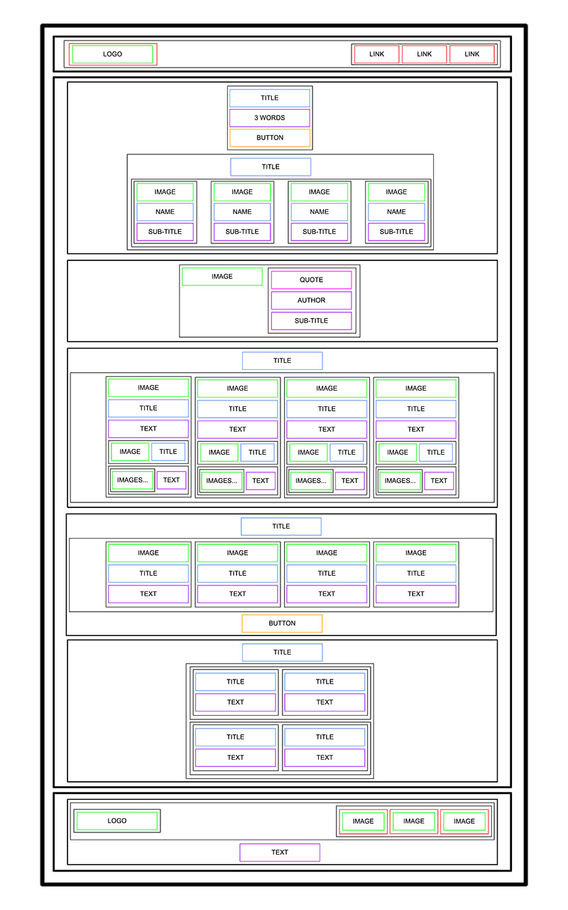

 
<h1> Homepage Layout - Figma Prototype </h1>

 

### Project Overview
This Figma prototype showcases the homepage layout for our digital platform. It is designed to present key features and branding elements with a clean, user-friendly interface. The goal of the prototype is to guide the visual direction and interaction flow for stakeholders, developers, and designers.

# Key Sections

- `Hero Section`: Bold welcome message and call-to-action button.

- `Feature Highlights`: A brief overview of what the platform offers.

- `Testimonials / Social Proof`: Showcasing user feedback or partnerships.

- `Footer`: Includes essential links and contact information.

### Thanks :smile: